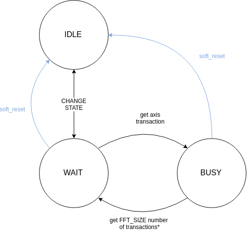

# Window function IP core

by Konovalov Vitaly

## Decription

IP core performs user-defined window function on a data stream. It has a simple state machine to control data flow and registers configuration. The core is designed to be integrated into a microcontroller system. All math in the IP core operates with complex numbers.

IP core had AXI-Stream compatible interfaces for the data path and simplified AMBA APB interface for configuration and control. AXI-Stream buses width is configurable through a parameter and supports 2, 4 or 8 (larger values were not tested). 

All math is done with 32-bit complex numbers (consist of 16 bits for real and 16 bits for imaginary part). Output data width is doubled - 32 bits for each part, real and imaginary, resulting in 64 bits for each complex number.

## Features

- Configurable data bus number.

- 32-bit complex math.

- AXI-Stream data interfaces.

- Simple AMBA APB control interface.

- A separate memory module for window samples storage (synthesisable into block memory).

- Pipelined math with additional registers for retiming.

## Configuration parameters

| Parameter    | Description                                                  |
| ------------ | ------------------------------------------------------------ |
| FFT_SIZE     | FFT size. Should be a power of 2. Tested values: 128, 512, 2048, 4096, 8192. |
| BUS_NUM      | Number of parallel data buses in AXI-Stream interfaces. Tested values 2, 4 and 8. Should be a power of 2. |
| APB_A_REV    | Control of APB address bit revert. Value 0 do nothing, value 1 reverts all bits in *PADDR* bus when accessing window sample registers. This behaviour could be convenient when interfacing the IP core with FFT IP, which output samples go in the bit-reverse order. |
| ADD_PIPE_NUM | Number of additional pipeline stages in math path for retiming. |
| APB_AW       | *PADDR* bus width. Do not change this parameter outside.     |

## Interfaces

### AXI-Stream input interface

| Signal    | Direction | Width                       | Description                                                  |
| --------- | --------- | --------------------------- | ------------------------------------------------------------ |
| in_tvalid | in        | 1                           | AXI-Stream slave tvalid input.                               |
| in_tready | out       | 1                           | AXI-Stream slave tready output.                              |
| in_tdata  | in        | \[BUS_NUM-1:0]\[1:0]\[15:0] | AXI-Stream slave tdata input. Width of the bus is configurable through BUS_NUM parameter. In each sub-bus 0 is a Re part and 1 is an Im part of a complex value. |

### AXI-Stream output interface

| Signal     | Direction | Width                       | Description                                                  |
| ---------- | --------- | --------------------------- | ------------------------------------------------------------ |
| out_tvalid | out       | 1                           | AXI-Stream master tvalid output.                             |
| out_tready | in        | 1                           | AXI-Stream master tready input.                              |
| out_tlast  | out       | 1                           | AXI-Stream master tlast output. TLAST is generated inside the IP core and it marks FFT size packet boundaries. |
| out_tdata  | out       | \[BUS_NUM-1:0]\[1:0]\[15:0] | AXI-Stream master tdata output. Width of the bus is configurable through BUS_NUM parameter. In each sub-bus 0 is a Re part and 1 is an Im part of a complex value. |

### AMBA APB interface

| Signal  | Direction | Width  | Description                                                  |
| ------- | --------- | ------ | ------------------------------------------------------------ |
| psel    | in        | 1      | APB slave PSEL signal. Account for slave selection.          |
| penable | in        | 1      | APB slave PENABLE signal.                                    |
| paddr   | in        | APB_AW | APB slave PADDR bus. Address of the register to access. The width is based on the FFT_SIZE parameter. |
| pwrite  | in        | 1      | APB slave PWRITE signal. Value 1 corresponds to write operation, value 0 corresponds to read operation. |
| pwdata  | in        | 32     | APB slave PWDATA bus. Data for a write operation.            |
| prdata  | out       | 32     | APB slave PRDATA bus. Returned by the IP core data on a read operation. |

**Note:** APB interface do not have signal PREADY. This means that salve is always ready for operation and PREADY=1.

## FSM operation

### IDLE

In this state module does nothing. You can access and configure all registers. This is the only state then it is possible to configure window sample registers (address x0000-[(FFT_SIZE-1)*4]). After receiving *CHANGE STATE* command FSM moves to the **WAIT** state.

### WAIT

In this state, the FSM is waiting for a new packet on the AXI-Stream input.  Reception of a new AXI-Stream packet moves FSM to the **BUSY** state. *CHANGE STATE* command moves FSM back to the **IDLE**.

### BUSY

In the **BUSY** state module handles the packet. After a number of the data samples equal to the FFT size is received on the input AXI-Stream interface*, FSM goes to the **WAIT** state.

**Note:** In any state write 1 to FSM reset register puts FSM into the IDLE state.

**Note:** ***** Actually transition from the **BUSY** to the **WAIT** is based on the internal *TLAST* signal, which belongs to the output of the first input stage of the pipeline. These can cause a situation, there several upcoming transactions of the next consequent packet could be pushed into the IP core pipeline before user commands to handle the next packet. So, if you are making switch or packet demultiplexer on the AXI-Stream bus before the IP core, you should keep it in mind.

## APB registers map

Each register is aligned to 32-bit word bounds, which means 2 least significant bits of paddr bus are not used and should always be zeros.

Register field types:

- **RW** - Read-Write field
- **WO** - Write-Only field
- **RO** - Read-Only field

### Window sample

_Address: x0000 - [(FFT_SIZE-1)*4]_

| BITS  | ACCESS | RST VALUE | DESCRIPTION                     |
| ----- | ------ | --------- | ------------------------------- |
| 31-16 | RW     | xXXXX     | Imaginary part of window sample |
| 15-0  | RW     | xXXXX     | Real part of window sample      |

**Note:** If parameter APB_A_REV=1, the address of these registers is bit-reversed. For instance, if FFT_SIZE=8192 and you are writing to address x0004, you will access x4000 instead. This was done to simplify work with reverted-order packets from FFT.

**Note:** It is possible to access these registers only while FSM is in the IDLE state.

### Control register

_Address:  [FFT_SIZE*4]_

| BITS | ACCESS | RST VALUE | DESCRIPTION                                       |
| ---- | ------ | --------- | ------------------------------------------------- |
| 31-9 | RO     | x000000   | Unused                                            |
| 8    | RW     | -         | Writing 1 executes command *CHANGE STATE*         |
| 7-1  | RO     | x00       | Unused                                            |
| 0    | WO     | -         | FSM reset. Writing 1 puts FSM into the IDLE state |

**Note:** In **IDLE** and **WAIT** states command *CHANGE STATE* immediately forces FSM to move to the next state. In this case, corresponding bit (bit 8) in the Control register is deasserted on the next clock edge after it was asserted. However, in the **BUSY** state this bit stores its value and waiting for FSM to move to another state.

### Status register

_Address:  [(FFT_SIZE+1)*4]_

| BITS  | ACCESS | RST VALUE | DESCRIPTION                           |
| ----- | ------ | --------- | ------------------------------------- |
| 31-10 | RO     | x000000   | Unused                                |
| 9-8   | RO     | x0        | FSM state. IDLE=x0, WAIT=x1, BUSY=x2. |
| 7-0   | RO     | x00       | Unused                                |

## Testing environment

The provided test environment is a bit messy but is designed to support automated runs for all possible configurations of IP core. All testing was done with _ModelSim ALTERA STARTER EDITION 10.5b 2016.10_ and _Python 3.6.6_ (probably script could work with earlier versions of Python).

Automated testing works in the following way: firstly, the python script creates input files for the Verilog testbench and reference file with results. Thereafter script calls modelsim and pass configuration parameters to it. Eventually, testbench generates its own output file with results and python script compares this file with the reference file.